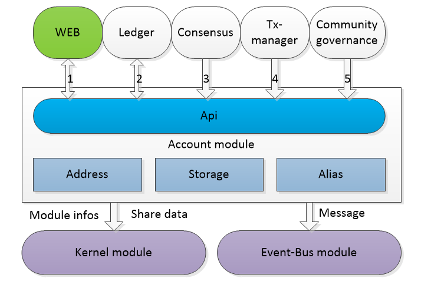
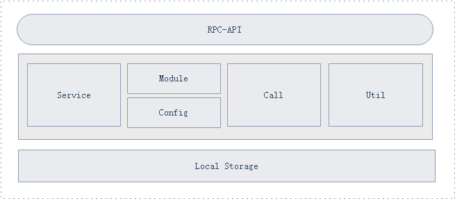
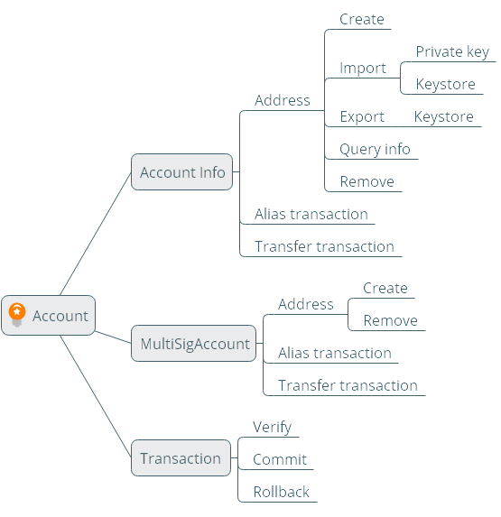

# 账户模块设计文档

[TOC]

## 总体概览

### 模块概述

#### 为什么要有账户模块

在区块链中地址及其相关信息有着极其重要的作用，关乎着数据安全的问题。而且账户地址的相关信息也是和用户交互最多的部分。虽然整个账户地址信息结构简单，但是功能比较复杂，所以我们独立出一个账户模块，来处理账户地址的相关信息和功能。

#### 账户要做什么

账户模块是提供关于账户各项功能的基础性模块。主要对账户的生成、安全和保管、信息的获取等几个方面的功能提供支持，其他模块可以根据账户模块提供的接口来使用账户的各种功能以及获取账户信息，用户或者其他应用可以根据RPC接口对账户进行更加实用性和个性化的操作。账户是基础模块，也是用户数据的载体 。

- 账户的生成

  创建账户、导入账户

- 账户的安全和保管

  账户的备份、设置账户密码、修改账户密码、移除账户

- 账户信息的获取

  查询单个账户信息、获取多个账户信息、获取账户地址、查询账户余额、查询账户别名

- 其他实用性和个性化功能

  设置账户别名、设置账户备注、签名等

#### 账户在系统中的定位



账户是底层模块，与账本、共识、交易、内核、事件总线、社区治理模块有依赖关系。

1、账户模块依赖账本模块

	ledger模块需要处理本地交易，依赖于账户信息。
	
	账户模块需要发起设置别名交易，需要ledger模块支付费用
	
	账户余额查询，需要依赖ledger模块

2、账户模块依赖内核模块

```
上报模块信息、共享数据操作
```

3、账户模块依赖网络模块

```
通过网络模块来接收和发送数据
```

4、账户模块依赖事件总线模块

```
创建账户、删除账户、修改密码事件通过事件总线模块发送消息
账户模块并非强依赖事件总线模块，因为即使事件发送失败也不影响业务正常流程
```

5、共识模块依赖账户模块

```
共识需要账户信息进行打包出块
```

6、交易管理模块依赖账户模块

```
交易管理模块要对交易进行验证，依赖账户中address功能，验证地址是否合法等
```

7、社区治理模块依赖账户模块

```
社区治理需要账户签名
```

### 架构图




1、API：对外提供接口层，提供账户的创建、备份、设置别名等操作；

2、业务逻辑层：定义账户、账户地址、别名的功能；

3、数据持久化层：保存账户、别名数据；

## 功能设计

### 功能架构图




### NULS协议地址详解

#### ECKey  

创建一个NULS地址的第一步，需要获取一个基于椭圆曲线算法的公私钥对。NULS的椭圆曲线参数和比特币一样，使用secp256k1。

#### 地址格式  

```
address = prefix + Base58Encode(chainId+addressType+pkh+xor)
```

- address 长度为23

- chainId为当前链的链id，用于区分不同链的地址

- addressType地址类型分为 ，1:普通地址，2:智能合约地址，3:多重签名地址。

#### 前缀  

前缀prefix的存在是为了便于识别、区分不同的链的地址。目前NULS提供了两种prefix的确定方案:

1. 默认设置：NULS保留1为主网chainId，也默认所有chainId为1的地址以NULS开头。保留2为核心测试网的chainId，默认所有chainId为2的地址以tNULS开头。
2. 通过登记跨链设置前缀：在登记跨链时，需要填写此链的前缀，系统会维护chainId和前缀的对应表，根据对应表生成相应的地址。
3. 自动计算：其他chainId的地址，NULS提供了统一的算法来计算前缀，具体的计算代码如下：

```
//将chainId转换为字节数组，使用base58算法对字节数组进行计算，计算后全部转为大写字母
String prefix = Base58.encode(SerializeUtils.int16ToBytes(chainId)).toUpperCase();
```

在前缀和真实地址之间，用一个小写字母进行分隔，便于从地址中提取chainId和验证地址类型及正确性。
小写字母的选择方式为，提供一个数组，安装字母表的顺序填充小写字母，根据prefix的长度来选择分隔的字母。

```
//前缀长度是几个字母，就选择第几个元素为分隔字母。
//如前缀长度为2，则用b分隔，长度为3用c分隔，长度为4用d分隔，……
String[] LENGTHPREFIX = new String[]{"", "a", "b", "c", "d", "e"};
```

#### 链id  

NULS的目标是建立一个多链并行，价值互通的区块链生态网络，在设计之初就为每一条链定义了一个独一无二的ID，2个字节，取值范围1~65535.ChainId是地址中非常重要的数据，是跨链操作的基础。

#### 账户类型  

NULS支持在一个网络内设置不同的账户类型，比如普通地址、合约地址、多签地址等等，开发者可以根据自己的需要进行设计。
账户类型为1个字节，1~128取值范围

#### 公钥摘要PKH  

ECKey与地址的关联关系就体现在这一部分，NULS的做法是先用Sha-256对公钥进行一次计算，得到的结果再通过 RIPEMD160进行一次计算得到20个字节的结果，就是PKH。

#### 校验位  

NULS在生成字符串格式的地址时会增加一个字节的校验位，计算方式是对前面23个字节（chainId+type+pkh）进行异或得到的。
校验位不参与序列化。

#### 生成地址  

- 序列化地址

  ```
  address = chainId(2) + type(1) + PKH(20)
  ```

- 固定前缀字符串地址

  ```
  addressString = prefix + 分隔符 + Base58Encode(address+xor)
  ```

- 自动前缀字符串地址

  ```
  addressString = Base58Encode(chainId) + 分隔符 + Base58Encode(address+xor)
  ```

#### 非nuls体系的地址格式  

NULS是一个网络，支持所有区块链的接入，对于和NULS完全不同的地址格式，NULS设计了一个地址转换协议，具体内容如下：

复制

```
address = Base58Encode(chainId+原始地址长度+原始地址+xor)
```

例如：比特币地址，在地址之前追加两个字节的chainId，之后跟随比特币的原始地址，地址解析方式根据链配置决定，确保任何一个地址都可以在NULS获得映射的地址。  

### 多重签名账户

参考[多重签名账户文档]()


## 模块服务

参考[账户模块RPC-API接口文档](./account.md)

## 协议

### 交易业务数据协议

* 设置别名

  * 协议

    与通用交易相比，只有类型和txData有区别，具体区别如下

  ```
  type: n //设置别名交易的类型
  txData:{
      address:  //VarByte 设置别名的地址
      alias：   //VarByte 别名字符串转成的字节数组，用UTF-8解码
  }
  ```

  - 别名交易参数

  | Len  | Fields  | Data Type | Remark                                |
  | ---- | ------- | --------- | ------------------------------------- |
  | 24   | address | byte[]    | 设置别名的地址                        |
  | 32   | alias   | byte[]    | 别名字符串转成的字节数组，用UTF-8解码 |

  * 验证器

  ```
  1、别名格式合法性验证
  2、地址必须是卫星链地址，且一个地址只能设置一个别名
  3、烧毁一个token单位
  4、交易手续费
  5、签名：设置的地址、input、签名三者验证
  ```

  * 处理器

  ```
  1、资产处理器
  2、存储alias数据
  3、更新本地账户信息
  ```


## Java特有的设计

* Account对象设计

  该表存储时使用的key：

  NULS体系：chainId+type+hash160

  非NULS体系：chainId+length+address


| `字段名称`      | ` type` | `说明`                                      |
| :-------------- | :------ | :------------------------------------------ |
| chainId         | short   | 链ID                                        |
| address         | String  | 账户地址（Base58(address)+Base58(chainId)） |
| alias           | String  | 账户别名                                    |
| status          | Integer | 是否默认账户（不保存）                      |
| pubKey          | byte[]  | 公匙                                        |
| priKey          | byte[]  | 私匙-未加密                                 |
| encryptedPriKey | byte[]  | 已加密私匙                                  |
| extend          | byte[]  | 扩展数据                                    |
| remark          | String  | 备注                                        |
| createTime      | long    | 创建时间                                    |

* Address对象设计（不持久化存储）

| `字段名称`   | ` type` | `说明`       |
| ------------ | ------- | ------------ |
| chainId      | short   | 链ID         |
| addressType  | byte    | 地址类型     |
| hash160      | byte[]  | 公匙hash     |
| addressBytes | byte[]  | 地址字节数组 |

- Alias对象设计

  该表存储时使用的key：

  address和alias分别作为key存储,别名数据存储两份

  需要按照不同的链分别创建不同的别名表

| `字段名称` | ` type` | `说明`   |
| ---------- | ------- | -------- |
| address    | byte[]  | 账户地址 |
| alias      | String  | 账户别名 |

- MultiSigAccount对象设计

| `字段名称` | ` type`      | `说明`             |
| ---------- | ------------ | ------------------ |
| address    | String       | 账户地址           |
| pubKeyList | List<byte[]> | 需要签名的公钥列表 |
| minSigns   | long         | 最少签名数         |


