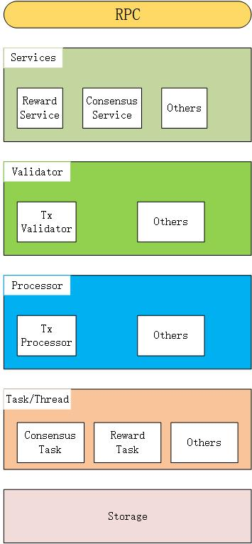
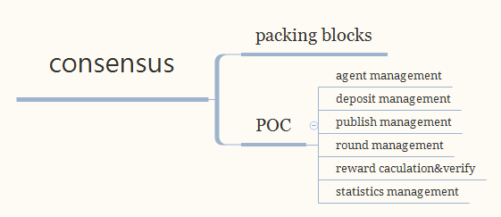
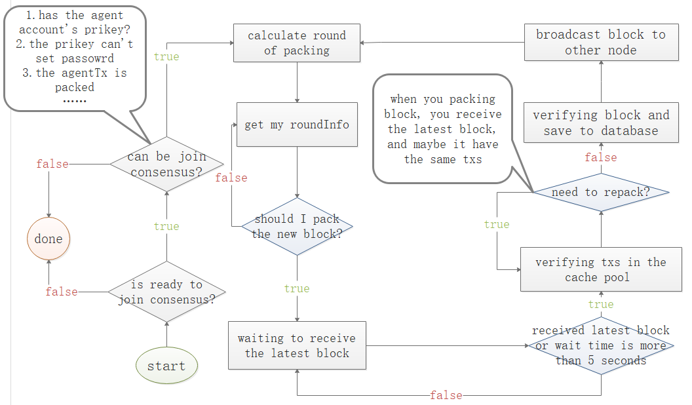

Consensus Module Design Document

[TOC]

## one、Overall description

### 1.1 Module Overview

#### 1.1.1 Why do we need a consensus module

​	As is well known, the core of blockchain is the consensus mechanism. Compared to traditional internetcliet-serverThe architecture is different, and the nodes in the blockchain are equal without a center, so everyone has the same rights；So, in order to achieve consistency in data, a consensus mechanism is used to maintain a set of universally recognized ledgers in a decentralized network.

​	In a broad sense, consensus mechanism is the rule or algorithm that each node in the blockchain follows together, which is the foundation for achieving mutual trust. Only in this way can decentralized and unregulated operations be achieved, and the normal operation of the entire platform be maintained.

​	Narrowly speaking, the consensus mechanism determines the mechanism by which each node verifies and confirms transactions on the blockchain.

#### 1.1.2 What should the consensus module do

​	Every transaction in blockchain must be recognized by each node, and only when the entire network reaches a consensus can the transaction be considered complete. Just like in democratic elections, the voting method or rules must be recognized by the people in order to complete the election. In blockchain, the main manifestation of consensus mechanism is incentive system, which is the reward given to miners. Under the guarantee of consensus mechanism, every miner can receive rewards, so that the entire blockchain can operate in an orderly manner and provide fairness、A transparent and trustworthy environment. Therefore, the consensus module needs to provide specific algorithms to maintain, namely consensus algorithms.

​	There are various consensus mechanisms for public chains, with mainstream ones beingPOW、POS、DPOS.NULSThe main network adopts independently created contentPOC（Proof Of Credit）Consensus mechanism, a type of inheritanceDposThe security and efficiency of the consensus mechanism, as well as significant improvements in collaboration, can be seen as an upgraded versionDpos.

​	POCResponsibilities of the consensus module：

- Legitimacy verification after block synchronization

- Create consensus nodes、Entrusting participation in consensus、Cancel delegation、Unregister consensus node★

- Package consensus nodes into blocks

- Distribution of network maintenance incentives

- Punishment for wrongdoing nodes★

  **PS：Different consensus mechanisms have different consensus algorithms, which are marked above★ForPOCConsensus specific**

#### 1.1.3 《Consensus module》Positioning in the system

​	The consensus module is a relatively core part of the system, mainly responsible for packaging transaction blocks, verifying block headers, managing consensus node information, delegation information, penalty information, etc. in the system.

### 1.2 Architecture diagram

（take care：Block download belongs to the block management module, redraw the image）



explain：

- Services layer：
  - tx service : Add, delete, modify, and check transactions
  - consensus service : Consensus Activity and Status Management II、functional design
- Validator
  - tx Validator: A validator for consensus related transactions, used to verify consensus related transactions
- Processor
  - Tx Processor:Consensus module related transaction processor, used to submit rollback detection transactions
- Task/Threadlayer：Timed tasks
  - consensus Task: Consensus packaging
  - Reward Task ： data statistics
- Storagelayer:Store transaction data related to consensus module

## two、Function Description

### 2.0 Functional architecture diagram



### 2.1Analysis of functional requirements for consensus module

#### 2.1.1 Support multi chain parallelism

NULS2.0The design concept is to provide modular services, and each module should support the simultaneous operation of data from multiple chains. Therefore, consensus modules need to implement algorithms with different consensus mechanisms. After the consensus module starts running, it can support multiple chains running simultaneously.


#### 2.1.2 POCConsensus mechanism

NULSThe main network adopts autonomousPOCConsensus mechanism, to achievePOCFirst of all, it is necessary to know thatPOCThe design philosophy and business rules are extracted from the following contentNULSwhite paperPOCThe consensus introduction section can be skipped directly if familiar.

```
Consensus mechanism——POC
	NULSThe main chain adopts a default credit consensus mechanism POC(Proof-Of-Credit). When the node's credit meets the standard, locking a certain margin can join the consensus. After reordering the consensus nodes, blocks are taken out in each round, and the margin is unlocked when exiting the consensus.
1、Consensus entry and exit mechanism
	Anyone can join at any timeNULSIn the consensus, as long as the conditions are met and the rules are followed, continuous acquisition can be achievedNULSToken rewards.POCThe addition of is divided into hard indicators and soft indicators. Hard indicators refer to credit scores that must meet a certain standard line, excluding some nodes that have committed wrongdoing. Soft indicators refer to the need to freeze a certain amount ofNULSAs a deposit, tokens are used to prevent node proliferation and make the entire system more fair. In addition to a minimum limit, anyone can freely choose the amount of deposit, which will be linked to the final reward.
1.1Yellow card warning
	Offline during consensus period due to node hardware configuration or network issues、Crashes and other situations where blocks cannot be generated are not considered violations, but they can have a certain impact on the entire system. Therefore, for such situations, the system has a mild warning mechanism：Reduce node credit value,
1.2Red card warning
	For some double flowers、Repeated block production、Attempting a fork system、Malicious human sabotage that does not comply with system rules,NULSThe system firmly resists and all nodes can detect the occurrence of such situations；Once a malicious node does attempt to challenge the system, the corresponding security deposit will be locked2A credit rating of one month and another will never reach the consensus threshold.
2、credit rating
	stay NULS In the system, credit is the integrity coefficient of an account in the system, and the credit of all accounts will be within the range[-1,1]Internally, automatically calculated through credit rating algorithm formulas.
	Credit evaluation formula：Credit base=Capability coefficient+Responsibility coefficient
	Capability coefficient：Calculate based on the number of blocks produced in history
	Responsibility coefficient：Calculate based on violations and block accuracy
3、Consensus rewards
	For the sake of the whole NULS The balance and fairness of the system, consensus rewards are calculated based on the comprehensive calculation of the margin submitted by all consensus nodes and the credit of the consensus nodes. Consensus reward calculation formula：see（chartp1）
4、Subchain consensus mechanism
	Access NULS The sub chains of are divided into two types, the first being through NULS The standard interface protocol for system access, the second method is through NULS Program deployment and integration.
	NULS It is a universal blockchain underlying infrastructure that does not run any application business on its main chain, and all application businesses are run by sub chains. adopt NULS The system can be quickly deployed based on NULS The sub chain can be customized flexibly with various operational parameters, including whether it supports basic tokens、encryption algorithm、Consensus mechanism、Storage mechanism, etc.
	NULS Defined a standard consensus module to provide interface compatibility with different consensus mechanisms.NULS The community will gradually develop POW、DPOS、POS、PBFT、POOL Verify consensus mechanisms such as pools for users to freely choose from.

```

*chartp1：Consensus reward calculation formula：*


##### stayPOCIn the system, there are agents、Principal、Packer、Reward these four characters.

- agent————The creator of the consensus node.NULSThe holder initiates a transaction to create a consensus node, records it in the chain, and tells everyone that I want to create a consensus node. The basic condition for creating a node is to lock it20,000—200,000individualNULSAnd there is no record of red card punishment, the purpose of setting this basic condition is to prove that you sincerely want to maintain it wellNULSThe basic network of.
- Packer————When creating a consensus node, the agent can specify a packager, who can be their other account or a technical friend. Most importantly, the packager can not hold anyNULSEven if the server participating in the consensus is hacked, users will not suffer huge losses, only the impact of profits after being attacked. It should be noted that the packager is the actual account that produces the block, and each time the block is packaged, it is necessary to sign the block. Therefore, the packaging account must not be set with a password.
- Rewarder————When creating a consensus node, agents can not only specify a packager, but also a beneficiary, specifying who can receive the rewards generated by the consensus
- Principal————NULSHolders can adjust their holdings based on factors such as the agent's credit rating and influenceNULSEntrust the agent to reach a consensus while enjoying the corresponding consensus benefits. If the quality or integrity of the agent's nodes are found to have decreased, the principal may withdraw their delegation at any time and switch to others.

##### stayPOCIn the system, there is a proxy created（Create consensus nodes）、Stop proxy node（Exit consensus）、Commission consensus、Cancel the delegation of four business logic.

- Create proxy（Create consensus nodes）：locking20,000—200,000individualNULSInitiate a registration agent transaction, which will be visible across the entire network after packaging and can be locked by othersNULSDelegate to the agent node.
- Stop proxy node（Exit consensus）：Agents can stop their agency qualifications at any time, initiate transactions to delete agency nodes, and once the transaction is packaged and confirmed, they will quickly exit the consensus and no longer participate in the production of new blocks. Locked during proxy registration2Ten thousandNULSmeeting72Unlocking after hours, other delegates delegate to the nodeNULSUnlock now.
- Commission consensus：hold2000And aboveNULSUsers can choose a proxy node to delegate and receive corresponding block revenue. Before exiting, the corresponding entrustedNULSWill be locked and unavailable. The highest acceptable level for a proxy node500,000NULSCommission.
- Cancel delegation：Users can revoke previous delegation and lock it after revocationNULSExplain immediately and no longer enjoy the corresponding consensus benefits.

##### POCTwo penalty mechanisms of the system

- Yellow card punishment：When a block output node fails to output a block due to various uncertain reasons such as network disconnection, machine lag, etc., or the output block is not adopted, it will receive a yellow card penalty in the next round. Yellow card punishment will affect the revenue of nodes；When continuously obtained100When a yellow card is penalized, a red card will be imposed.
- Red card penalty：When a block node makes a malicious fork、When behaviors such as Shuanghua seriously endanger network stability, or when continuously obtaining100When a yellow card is penalized, the system will give a red card penalty. Nodes that receive red card penalties will be forced to stop consensus, and the deposit when creating agents will be frozen3Months, and nodes can never be created again；The delegation corresponding to the node that receives a red card penalty will be immediately unlocked.

##### POCHidden functional requirements of internal systems

- Maintain a consensus node information table and update it based on the four types of transactions received in real-time.
- Maintain a round information table to randomly queue up agents who meet the block out criteria for each round.
- Proxy nodes that meet the block generation criteria verify and package transactions from the memory pool, assemble them into new blocks, and broadcast them to the entire network.

The above is a summary of the consensus modulePOCThe functional analysis of consensus mechanism implementation will be introduced in the next chapter, and the details of each functional implementation will be discussed.

### 2.2 Module Services

The consensus module is the core module of blockchain, and due to different consensus mechanisms, the services provided to the outside world are also different. Module services will affect the services shared by consensus modules andPOCProvide a detailed description of the mechanism specific services.

reference[Consensus moduleRPC-APIInterface documentation](./consensus.md)

### 2.3 Internal functions of the module

​	POCThe consensus mechanism involves nodes participating in the consensus block taking turns to block out, reach consensus, and jointly maintain a set of ledgers. But due to network reasons or some consensus nodes committing crimes（Sending different packaging blocks to different nodes）A fork may occur, and for such malicious nodes, the system will impose different penalties based on the severity of the situation. When it is the turn of a node to block, the system will give the node a yellow card punishment if it fails to block within the specified time. This punishment will reduce the node's credit value. When the node's credit value drops to-1At this time, the node will be penalized with a red card；For nodes with malicious behavior, a red card punishment will be directly imposed. Nodes that receive a red card punishment will stop packaging and can no longer create consensus nodes. The security deposit will be frozen for a certain period of time, and the amount of other entrusted nodes will be returned to the principal；When a node successfully blocks, it will receive a block reward, and the account that delegates the node will also receive a corresponding proportion of reward based on the amount of delegation.

​	In addition to providing packaged blocks, the consensus module also performs statistical work on reward funds, including24The total reward amount issued within the hour,24Accumulated reward amount for local account within hours,24Reward details within hours, etc

- Consensus module initiation process

  initialization：

  - 1.Load consensus module configuration information（Block interval time, reward gold lock determines the number of blocks）
  - 2.Registering consensus module transactions、Transaction validator、Transaction processor（Register with the trading module）
  - 3.Register Consensus Module Service Interface（Register with core modules）
  - 4.Registration Consensus Module Event（Register with the event bus module）

  start-up：

  - Obtain the latest round of block information from the database and calculate the round information
  - Obtain current protocol version information and cache it
  - Start various related threads

- Packaging and block production process
  - Determine whether the node meets the requirements to become a packaging node
  - Calculate packaging round information
  - Waiting for packaging out of blocks
  - Receive the latest block, if waiting5If the latest block has not been received in seconds, it will be defaulted that the previous block node has not produced a block, and the current node will continue to perform the packaging operation
  - Verify the transactions that need to be packaged, remove duplicate packaged transactions, and package new blocks
  - Verify the packaged new blocks and save the relevant data to the database
  - Broadcast Block





- Consensus reward statistics

  

  - Get a list of local accounts
  - obtain24Block list within hours
  - Traverse the block list to obtainCoinBasetransaction
  - according toCoinBaseTransactions, updates24The total reward amount within the hour,24Accumulated reward amount for local account within hours,24Reward details within hours

## three、Event Description

### 3.1 Published events

#### 3.1.1 Block packaging success event

```
explain：After a new area is successfully packaged, publish this event
```

```
 event_topic : "evt_cs_packing"
```

```
data:{
    "chainId":88,
    "smallBlock":"smallBlockSerializing objects into hexadecimal strings"
}
```


#### 3.1.2 Create nodes

```
explain：Publish this event when the transaction for creating a node is confirmed and packaged into a block
```

```
 event_topic : "evt_cs_createAgent"
```

```
data:{
    "chainId":88,
    "agentList":{    //List of consensus nodes created in packaged blocks
        "agent1",    //AgentSerializing objects as hexadecimal strings
        "agent2",
        "agent3"
    }
}
```


#### 3.1.3 Unregister node

```
explain：Publish this event when the cancellation node transaction is confirmed and packaged into a block
```

```
 event_topic : "evt_cs_stopAgent"
```

```
data:{
    "chainId":88,
    "agentList":{    //List of consensus nodes deregistered in packaged blocks
        "agent1",    //AgentSerializing objects as hexadecimal strings
        "agent2",
        "agent3"
    }
}
```


#### 3.1.4 Change in consensus node state（In consensus, in block production）

```
explain：Publish this event when the consensus node state changes
```

```
 event_topic : "evt_cs_agentStatusChage"
```

```
data:{
    "chainId":88,
    "agentList":{    //List of consensus nodes in the state table of the packaged block
        "agent1",    //AgentSerializing objects as hexadecimal strings
        "agent2",
        "agent3"
    }
}
```


#### 3.1.5 Commission consensus

```
explain：Publish this event when the entrusted consensus transaction is confirmed and packaged into a block
```

```
 event_topic : "evt_cs_deposit"
```

```
data:{
    "chainId":88,
    "depositList":{     //Package the delegation list in the block
        "deposit1",     //DepositSerializing objects into hexadecimal strings
        "deposit2"
    }
}
```


#### 3.1.6 Exit consensus

```
explain：Publish this event when the exit consensus transaction is confirmed and packaged into a block
```

```
 event_topic : "evt_cs_withdraw"
```

```
data:{
    "chainId":88,
    "depositList":{     //Exiting the delegation list in the packaged block
        "deposit1",     //DepositSerializing objects into hexadecimal strings
        "deposit2"
    }
}
```


#### 3.1.7 Yellow card punishment

```
explain：When a consensus node receives a yellow card penalty, the event is published
```

```
 event_topic : "evt_cs_yellowPublish"
```

```
data:{
    "chainId":88,
    "yellowPublishList":{    //List of yellow cards in packaged blocks
        "yellowPublish1",    //YellowPublishSerializing objects into hexadecimal strings
        "yellowPublish2"
    }
}
```


#### 3.1.8 Red card punishment

```
explain：Obtain the event when a consensus node receives a red card transaction
```

```
 event_topic : "evt_cs_redPublish"
```

```
data:{
    "chainId":88,
    "redPublishList":{    //Red card list in packaged blocks
        "redPublish1",    //RedPublishSerializing objects into hexadecimal strings
        "redPublish2"
    }
}
```


### 3.2 Subscribed events

```
nothing
```


## four、protocol

### 4.1 Network communication protocol

#### broadBlock

- Send new blocks（SmallBlock）
- according tohashGet blocks
- Send complete block
- Obtain multiple blocks based on height
- According to the transactionhashList acquisition transaction list
- Send transaction list
- according tohashobtainSmallBlock
- Obtain blocks based on height intervalshashlist
- Obtain based on altitude rangeSmallBlocklist

New Area Fast for Broadcast Packaging

| Length | Fields     | Type   | Remark                               |
| ------ | ---------- | ------ | ------------------------------------ |
| 4      | chainId    | int    | chainID                                 |
| ??     | smallBlock | String | SmallBlockHexadecimal string for object serialization |


## five、Module Configuration

```
{
    {
        "name": "packing_interval",
        "remark": "Packaging interval time",
        "changable": "true",
        "default": "10second"
    },
    {
    	"name": "packing_amount",
        "remark": "Minimum amount for block production",
        "changable": "true",
        "default": "200000"
    },
    {
    	"name": "coinbase_unlock_height",
        "remark": "Reward Gold Lock Block Count",
        "changable": "true",
        "default": "100"
    },
    {
    	"name": "redPublish_lockTime",
        "remark": "Obtaining red card deposit lock up time",
        "changable": "true",
        "default": "3Months"
    },
    {
    	"name": "stopAgent_lockTime",
        "remark": "Cancellation of node margin locking time",
        "changable": "true",
        "default": "3day"
    },
    {
    	"name": "commissionRate_min",
        "remark": "The minimum value of commission ratio",
        "changable": "true",
        "default": "10"
    },
    {
    	"name": "commissionRate_max",
        "remark": "Maximum commission ratio",
        "changable": "true",
        "default": "80"
    },
    {
    	"name": "deposit_min",
        "remark": "Minimum margin value for creating nodes",
        "changable": "true",
        "default": "20000"
    },
    {
    	"name": "deposit_max",
        "remark": "Maximum margin value for creating nodes",
        "changable": "true",
        "default": "700000"
    },
    {
    	"name": "commission_min",
        "remark": "Delegated minimum value",
        "changable": "true",
        "default": "2000"
    },
    {
    	"name": "commission_max",
        "remark": "Maximum Entrustment Value",
        "changable": "true",
        "default": "680000"
    }
}
```
