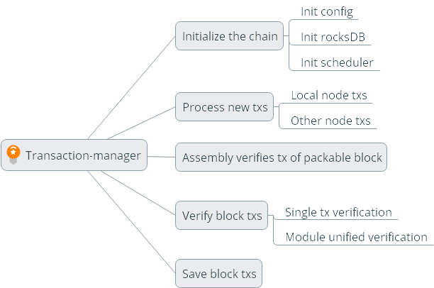
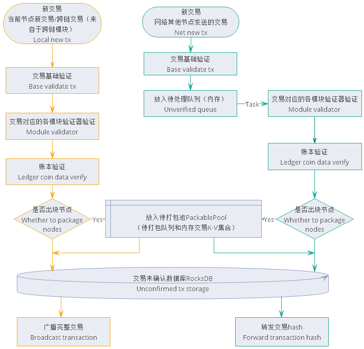

# Transaction Management Module Design Document

[TOC]

##  Overall Overview

### Module Overview

#### Why is there a trading module

​	stayNULS2.0In the ecosystem, transactions will flow within or between chains, and nodes in each chain not only need to handle transactions within the chain, but may also handle transactions across chains. Therefore, each node needs to handle more and more complex transactions, so we need a separate module to handle various transactions uniformly. And fromNULS2.0From the perspective of architecture design, we need an independent module to handle transaction collection、validate、Storage and forwarding functions are shared for all transactions、Uniformity, therefore we operate transaction management as an independent module.

#### What should the transaction module do

##### Process local transactions

- Collect transactions
- Local verification
- Extract packable transactions
- Submit、Rollback transaction
- Save unconfirmed、Packable and confirmed transactions
- Provide transaction data


#### Positioning of transaction modules in the system

In the entire system, the transaction module manages the collection and verification of all transactions, providing secure transaction data for each block in the blockchain, and storing and querying transactions for confirmed blocks.

Dependent on during normal operation

- Core modules
- Network module
- Ledger module
- Block module
- Chain management module


### Architecture diagram


The entire module is roughly divided into3Parts: interface、Implementation layer、Local storage

The implementation layer contains4Parts

- The implementation logic of interface functions
- Manager, Transaction Manager, Chain Manager
- Transaction manager, caching registration information for each transaction, including transaction validators, interface names for business submission and rollback.
- Various queues for transaction reception、Asynchronous verification processing and consensus push operations
- Cache, chain data, and other basic data

## functional design

### Functional architecture diagram



### Core processes 


#### Initialize Chain

When the module starts, it needs to read the configuration information of all existing chains to initialize each chain, and the default chain for configuration will be started the first time.

- Basic information of initialization chain

  ​	Load the configuration information of the chain, initialize various identifiers when running the chain、Status, etc.

- Initialize ChainRocksDBsurface

  ​	Creating various data stores for chain runtimeDBTable.

- Log for initializing the chain

  ​	Create various print log objects for the chain.

- Initialize the cache of the chain

  ​	Create a cache and queue for chain runtime.

- Initialize transactions in the chain trading module, such as cross chain transactions

  ​	Cross chain transactions in the registration transaction module will maintain a transaction type ofkeyThe registered transaction object isvalueofMapThe registered transaction object contains a transaction validator、Transaction Business Submission Interface、Transaction business rollback interfaceAPIInterface name, as well as some information about the transaction itself.

- Initialize chain task scheduler

  ​	Various scheduled tasks for creating chain runtime

  

#### Collect and process transaction processes



- Collect newly created transactions from each module of this node

  ​	NULS2.0The node operates in a modular manner, so it is composed of multiple core modules as a whole. As the transaction processing center of the node, the transaction module is not the assembler of all transactions of the node. Various transactions of the node are created by corresponding functional modules. Therefore, the primary task of the transaction module is to collect the transactions assembled by each module.

  ​	The functional module assembles transactions based on the data provided by the user. After assembly, the transaction validator first verifies the basic and business data of the transaction, and then verifies the ledger through the ledger module. The verified transactions are directly sent to the transaction module for the following operations, and then wait to enter the next step of the process.

  - DBUnconfirmed storage
  - The consensus node will put the transaction into the queue to be packaged
  - Broadcast to other nodes

  

- Collect transactions broadcasted by other nodes

  ​	Transactions broadcasted by other nodes will be sent through network messages, with the transaction being the first to be senthashThe transaction management module will send a message requesting a complete transaction after receiving it, and only then will it receive the complete transaction.

  ​	Due to the fact that a node is composed of modules as a whole, within the node, modules are trusted between each other, while nodes are untrusted between them. Therefore, unlike new transactions from receiving modules, when the transaction module receives transactions from other nodes, it must strictly verify the transaction and then wait to enter the next step of the process.

  - To repeat(Verify existence in unconfirmed and confirmed databases)
  - Call the validator corresponding to the transaction for verification
  - Calling the ledger for verification
  - DBUnconfirmed storage
  - The consensus node will put the transaction into the queue to be packaged
  - Forward to other nodes

  Only transactions that fail verification solely because they are orphan transactions will be temporarily placed in the orphan pool for processing, and all other transactions that fail verification will be discarded.

> Orphan Trading：It refers to the ability of transaction data to be verified and tradednonceIf the value is not used by other transactions but cannot be linked to existing transactions, it will be considered an orphan transaction.


#### Transaction of node packaging for new blocks

​	Only consensus nodes have the process of packaging new area fast transactions. The instruction for the transaction module to start packaging new area block transactions is issued by the consensus module. The consensus provides the execution deadline for the assembly transaction, the total transaction capacity of the current block that can be packaged, and other data, which are then packaged by the transaction module.

​	When packaging block transactions in the transaction module, the first step is to start with thePackablePoolTo be packaged queue（First in, first out）Retrieve transactions from the database and then perform ledger verification on the ledger module. This verification is done in batches to reduce inter module interactions during large-scale transactionsRPCCall. For the stability of the network, there is a limit on the number of transactions packaged in a block. In the absence of system transactions, the default maximum for a block is110000 transactions.

​	Transactions that fail ledger verification and confirmed transactions will not be included in the packable transaction set（If it is an orphan transaction, it will be placed back in the waiting queue for packaging. In order to prevent permanent orphan transactions from being repeatedly retrieved and put back, the number of times they can be put back will be limited to affect the system）

​	After verifying the ledger, if it is a smart contract transaction, it is necessary to execute the smart contract, and then group the transactions according to the registered modules. After reaching the reserved unified verification time threshold, stop continuing to retrieve transactions from the queue, and call the unified validators of each module according to the divided groups to verify and conflict detect the transactions.

​	If there is a transaction that fails verification during the module unified verification stage, it will be removed from the extracted packable transaction set. If it is an orphan transaction, it will still be placed back in the waiting queue for packaging, and all extracted packable transactions will be re executed with the complete verification logic until all transactions pass the unified verification of each module. If a smart contract transaction has been executed, the smart contract module will be used to obtain the smart contract result, and the newly generated transaction will be added to the packable transaction combination queue, and then all transactions will be returned to the consensus module for packaging.

> - During the process of packaging new block transactions, if there is a change in the local latest height, that is, if the new block is received and saved successfully, the packaging will be abandoned. All retrieved transactions will be put back into the queue to be packaged, and then the new block transaction packaging will be restarted.
> - When packaging new block transactions, if the execution time exceeds the deadline, consensus will assemble new blocks without transactions.


#### Verify transactions in the block

​	Verifying the transactions of a block is one of the processes for the block module to process new blocks. The transaction module gets all the transactions in a complete block, first takes out the transactions in turn, performs basic verification on the transactions, and then calls the ledger for verification；If it is not a cross chain transaction generated by this chain, the cross chain verification results of the cross chain transaction should also be verified；If it is a smart contract transaction, it is necessary to execute the smart contract once, compare the existing results with the newly generated results, and finally group them, calling the module's unified validator for verification；If one of the verifications fails, the entire block transaction will fail verification, and it will be returned as failed.

​	If the received block contains cross chain transactions, the results of cross chain verification need to be verified during verification.


#### Save transactions in blocks

​	Saving block transactions is one of the processes in which the block module processes the block. The data in the table name block has been validated and entered the save phase. When saving transactions, all transactions are first saved to the confirmed stageDBdatabase；Then call the business submission interfaces of all transactions separately and perform processing on the business data of the transactions；Then submit it to the ledger module, and compare the ledger andnonceValue submission；Finally, it was never confirmedDBDelete the corresponding transaction in. If there is an operation failure midway, the process that has been successfully operated will be rolled back.

> The process of rolling back block transactions is to execute the process of saving block transactions in reverse order


## Universal Transaction Protocol

NULSAdopting a universal transaction protocol format, it mainly consists of the following fields：

| Len  | Fields   | Data Type | Remark             |
| ---- | -------- | --------- | ------------------ |
| 2    | type     | uint16    | Transaction type           |
| 4    | time     | uint32    | Time, accurate to seconds     |
| ？   | txData   | VarByte   | Business data           |
| ？   | coinData | VarByte   | Asset data           |
| ？   | remark   | VarString | Remarks               |
| ？   | sigData  | VarByte   | Contains public key and signature data |


**type**

Used to distinguish different business transactions, each module can register multiple transaction types, and each transaction type can have different verification logic、Processing logic. The range of values is1~65535.
Different transaction types should not have duplicate settingstypeThe system does not allow duplicatetypeRegister.
System support for extensions：greater than100oftype

**time** 

The time of transaction occurrence, accurate to seconds, without mandatory restrictions, can be any value rangeuint32The number inside.

**txData**  

Used for expanding business data, ledger not validatedtxDataContent, any data can be stored here. at presentNULSThe business data in the built-in transaction types is stored intxDataIn the field. After registering a transaction type, the business module will provide three interfaces for verification and processingtxDataData in（verifyTx,commitTx,rollbackTx）.

**CoinData**  

Asset data for transactions,NULSCurrently, a universal set ofCoinDataThe format is as follows

```
froms://List<CoinFrom>Format,
tos://List<CoinTo>format
```

notes：Support transferring different assets from multiple accounts to different accounts in the same transaction

CoinFromstructure[70]

```
address:  //byte[24] Account address  
assetsChainId://uint16 Asset issuance chain
assetsId: //uint16 asset
amount：  //uint128Transfer out quantity
nonce  ： //byte[8] Transaction sequence number, from the previous transactionhashAfter8Bytes
locked ： //byte Is it in a locked state(locktime:-1),1Represents locking,0Representing non locked
```

CoinTostructure[68]

```
address:  //byte[24],Target address
assetsChainId://uint16 Asset issuance chain
assetsId: //uint16 asset
amount :  //uint128Transfer amount
lockTime：//uint32,Unlocking height or unlocking time,-1To permanently lock
```

Handling fees

```
froms-tosThe remaining part is the handling fee（The model supports multiple asset payment fees, and the constraint conditions are determined by the economic model design）
```

**remark**  

Note that the data for this content will be passed throughutf-8Convert the encoding to a string and display it in the browser and wallet. It can also be usedremarkBusiness extension for field based transactions.

**sigData** 

Signature data supports signatures from multiple accounts, with each signature consisting of four parts：Public key length、Public key、Signature data length、Signature data.

**TransactionalHashcalculate** 

Divide the transactionsigDataSerialize the external data to obtain a complete byte array. applySha-256Perform two calculations on the data to obtain32BitwiseHashValue.


## Module Services

reference[Transaction Management ModuleRPC-APIInterface documentation](./transaction.md)


## Network Message Body Protocol 

### ForwardTxMessage

- Message Description：After receiving and verifying new transactions sent by other nodes in the network, the node forwards the transactionhashTo other nodes
- cmd：newHash

| Length | Fields | Type   | Remark           |
| ------ | ------ | ------ | ---------------- |
| 32     | hash   | byte[] | transaction hash |

- Message processing
  - newHashProcess the message and send a message requesting the complete transaction


### BroadcastTxMessage

- Message Description：Broadcast complete transactions to other nodes in the chain
- cmd：receiveTx

| Length | Fields               | Data Type | Remark         |
| ------ | -------------------- | --------- | -------------- |
| 2      | type                 | uint16    | Transaction type       |
| 4      | time                 | uint32    | Transaction time       |
| ？     | txData               | VarByte   | transaction data       |
| ？     | coinData             | VarByte   | Transaction inputs and outputs |
| ？     | remark               | VarString | Remarks           |
| ？     | transactionSignature | VarByte   | Transaction signature       |

- Message processing
  - receiveTxEnter a new transaction process


### GetTxMessage

- Message Description：Received transactions forwarded by other nodeshashRequest the complete transaction from the sender
- cmd：askTx

| Length | Fields | Type   | Remark           |
| ------ | ------ | ------ | ---------------- |
| 32     | hash   | byte[] | transaction hash |

- Message processing
  - askTxProcess the message and send the complete transaction back


