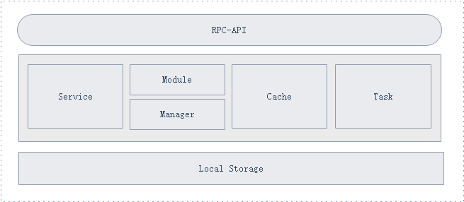
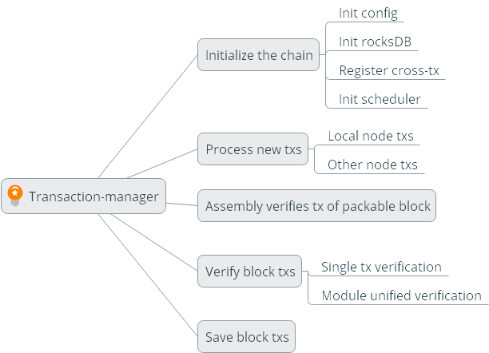
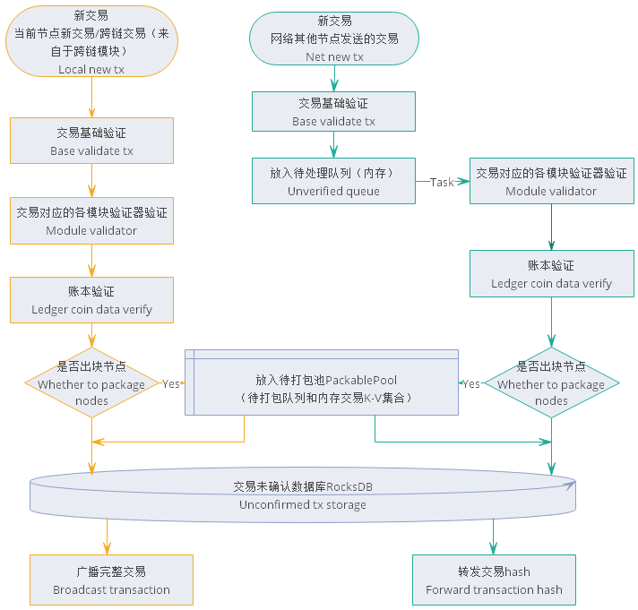

# 交易管理模块设计文档

[TOC]

##  总体概览

### 模块概述

#### 为什么有交易模块

​	在NULS2.0的生态体系中，交易会在链中或者链与链之间流转，各条链的节点不仅要处理链内的交易，可能还会处理跨链的交易，于是每个节点需要处理的交易会越来越多，并且更复杂，因此我们需要一个但单独的模块来统一处理各种交易。而从NULS2.0的架构设计来看，我们需要一个独立的模块来处理交易的收集、验证、存储以及转发等功能，对于所有交易来说，这些功能具有共用性、统一性，因此我们把交易管理作为一个独立的模块来运行。

#### 交易模块要做什么

##### 对本地交易进行处理

- 收集交易
- 本地验证
- 提取可打包的交易
- 提交、回滚交易
- 保存未确认的、可打包的以及已确认的交易
- 提供交易的数据

#### 交易模块在系统中的定位

在整个系统中，交易模块管理着所有交易的收集，验证，为区块链中的各个区块提供安全的交易数据，为已确认的区块提供交易的存储和查询。

正常运行时需要依赖

- 核心模块
- 网络模块
- 账本模块
- 区块模块
- 链管理模块

### 架构图

整个模块大致分为3个部分: 接口、实现层、本地存储

实现层中含有4个部分

- 接口的功能实现逻辑
- 管理器，交易管理器，链的管理器
- 交易管理器，缓存各个交易的注册信息，包含交易的验证器，业务提交与回滚的接口名。
- 各种队列，用于交易接收、异步验证处理以及推送共识等操作
- 缓存，链数据等基础数据

## 功能设计

### 功能架构图

### 核心流程 

#### 初始化链

模块启动时需要读取已存在的所有链的配置信息来对各条链进行初始化，第一次将启动配置的默认链。

- 初始化链的基本信息

  ​	加载链的配置信息，初始化运行链时的各种标识、状态等。

- 初始化链RocksDB表

  ​	创建链运行时的各项数据存储的DB表。

- 初始化链的日志

  ​	创建链的各个打印日志对象。

- 初始化链的缓存

  ​	创建链运行时的缓存和队列。

- 初始化链交易模块的交易，如跨链交易

  ​	注册交易模块中的跨链交易，将维护一个以交易类型为key，交易注册对象为value的Map，交易注册对象中含有交易验证器、交易业务提交接口、交易业务回滚接口的API接口名称，以及交易自身的一些信息。

- 初始化链任务调度器

  ​	创建链运行时的各种定时任务

  

#### 收集处理交易流程

- 收集本节点各模块新创建的交易

  ​	NULS2.0的节点是模块化运行的，所以节点是由多个核心模块组成的一个整体，而交易模块作为节点的交易处理中心，却并非是节点所有交易的组装者，节点的各种交易是由对应的各个功能模块所创建的。因此交易模块的首要工作就是要收集各个模块所组装的交易。

  ​	功能模块根据用户提供的数据进行交易组装，组装完成后首先要执行交易验证器对交易进行基础数据和业务数据的验证，然后通过账本模块进行账本的验证，通过验证的交易，直接发送给交易模块进行以下几个操作，然后等待进入下一步流程。

  - DB未确认存储
  - 共识节点会将交易放入待打包队列
  - 广播给其他节点

  

- 收集其他节点广播的交易

  ​	其他节点广播的交易，将会通过网络消息的方式进行发送，首先发送的是交易的hash，交易管理模块收到后再发送索取完整交易的消息，之后才会接收到完整的交易。

  ​	由于节点是由模块组成的一个整体，所以在节点内部，模块之间是可信的，而节点之间是不可信的，因此与接收模块的新交易不同，当交易模块收到其他节点的交易时，要对该交易进行严格的验证，然后等待进入下一步流程。

  - 去重复(在未确认和已确认数据库中验证是否已存在)
  - 调用交易对应的验证器进行验证
  - 调用账本进行验证
  - DB未确认存储
  - 共识节点会将交易放入待打包队列
  - 转发给其他节点

  只有仅仅因为是孤儿交易而没有验证通过的交易会被暂时放入孤儿池等待处理，其他所有未验证通过的交易会被丢弃。

> 孤儿交易：是指交易数据能通过验证，交易nonce值未被其他交易使用，但不能连上已存在的交易，会被判定为孤儿交易。

#### 节点打包新区块的交易

​	只有共识节点才会有打包新区快交易的流程，交易模块开始打包新区块交易的指令是由共识模块发出的，共识提供组装交易的执行截止时间，当前区块可打包交易总容量大小等数据，交由交易模块进行打包。

​	交易模块打包区块交易时，首先从待打包队列（先进先出）中取出交易，然后到账本模块进行交易的账本验证，由于打包和验证保存区块的操作可能会并行处理，所有为了避免已确认交易的nonce值能够按照正确的逻辑验证，我们需要在验证账本前后都需要检查该交易是否已经被加入其他区块进行确认了。

​	账本验证不通过的交易与已确认的交易将不会放入可打包交易集合中（如果是孤儿交易，将会重新放入待打包队列里，为了防止出现永久性的孤儿交易重复的被取出和放回对系统成影响，放回的次数会被限制）

​	通过账本验证后，如果是智能合约交易还需要执行智能合约，然后再将交易按交易注册的模块进行分组，在达到预留的统一验证时间阈值后，停止从队列里面继续获取交易，并按分好的组，分别调用各个模块的统一验证器，对交易进行验证与冲突检测。

​	如果在模块统一验证阶段，有验证不通过的交易，将会从取出的可打包交易集合中移除该交易，如果是孤儿交易，仍然重新放入待打包队列里，并且所有取出的可打包交易将重新执行打包的完整验证逻辑，直到全部的交易都通过各模块的统一验证。如果有执行过智能合约交易，这时将会去智能合约模块获取智能合约结果，并将新产生的交易加入可打包交易结合队尾，然后返回所有交易给共识模块进行打包。

> - 在打包新区块交易的过程中，如果本地最新高度产生变化，即收到新区块并保存成功，则放弃本次打包，所有取出的交易放回待打包队列，然后重新开始执行新的区块交易打包。
> - 在打包新区块交易时，如果执行时间超过截止时间，共识将组装没有交易的新区块。

#### 验证区块中的交易

​	验证区块的交易是区块模块处理新区块的流程之一，交易模块得到一个完整区块中的所有交易，首先依次取出交易，并对交易进行基础校验，然后调用账本进行验证；如果不是本链产生的跨链交易，还要核对跨链交易的跨链验证结果；如果是智能合约交易，需要执行一次智能合约，然后比较已有的结果和新产生的结果是否一致，最后进行分组，调用模块统一验证器进行验证；所有验证有一项不通过则整个区块交易都验证失败，直接返回不通过。

​	如果收到的区块中含有跨链交易，验证时需要核对跨链验证的结果。

#### 保存区块中的交易

​	保存区块的交易是区块模块处理区块的流程之一，表名该区块的数据已经通过验证进入保存阶段，保存交易时，首先将所有交易保存到已确认DB数据库；然后分别调用所有交易的业务提交接口，对交易的业务数据执行处理；然后提交到账本模块，对账本和nonce值进行提交；最后从未确认DB中删除对应的交易。如果中途有操作失败，将对已操作成功的流程进行回滚。

> 回滚区块交易的流程就是倒序执行保存区块交易的流程

## 模块服务

参考[交易管理模块RPC-API接口文档](transaction.md)

## 网络消息体协议 

### ForwardTxMessage

- 消息说明：节点接收并验证网络其他节点发送的新交易之后转发交易hash给其他节点
- cmd：newHash

| Length | Fields | Type   | Remark           |
| ------ | ------ | ------ | ---------------- |
| 32     | hash   | byte[] | transaction hash |

- 消息处理
  - newHash处理该消息，发送索要该完整交易的消息

### BroadcastTxMessage

- 消息说明：向链内其他节点广播完整交易
- cmd：receiveTx

| Length | Fields               | Data Type | Remark         |
| ------ | -------------------- | --------- | -------------- |
| 2      | type                 | uint16    | 交易类型       |
| 4      | time                 | uint32    | 交易时间       |
| ？     | txData               | VarByte   | 交易数据       |
| ？     | coinData             | VarByte   | 交易输入和输出 |
| ？     | remark               | VarByte   | 备注           |
| ？     | transactionSignature | VarByte   | 交易签名       |

- 消息处理
  - receiveTx进入新的交易流程

### GetTxMessage

- 消息说明：收到其他节点转发的交易hash，向发送者索要完整交易
- cmd：askTx

| Length | Fields | Type   | Remark           |
| ------ | ------ | ------ | ---------------- |
| 32     | hash   | byte[] | transaction hash |

- 消息处理
  - askTx处理该消息，发送完整交易回去

